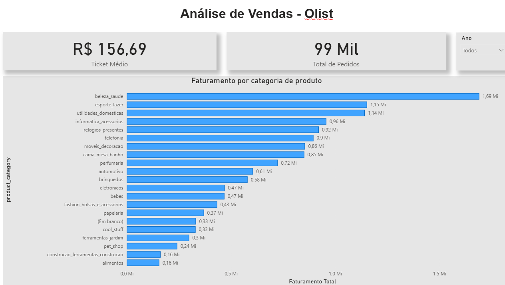

# Análise de Vendas para o E-commerce Olist

## 📄 Resumo do Projeto
Este projeto realiza uma análise completa de dados de vendas da Olist, uma grande empresa de e-commerce no Brasil. O objetivo é transformar dados brutos em insights acionáveis através da construção de um Data Warehouse no PostgreSQL e um dashboard interativo no Power BI.

Todo o processo, desde a extração e tratamento dos dados (ETL) até a criação das visualizações finais, foi desenvolvido para demonstrar um fluxo de trabalho de Business Intelligence de ponta a ponta.

---

## Dashboard Final (Power BI)



---

## 🎯 Objetivo de Negócio
A análise foi guiada para responder a perguntas de negócio chave para a Olist, como:

* Qual o faturamento total e a evolução mensal de vendas?
* Quais são as 5 categorias de produtos mais vendidas?
* Quais estados possuem o maior número de clientes e volume de vendas?
* Qual é o método de pagamento mais utilizado pelos clientes?
* Como está a distribuição das avaliações (reviews) dos pedidos?

---

## 🛠️ Ferramentas Utilizadas
* **ETL e Modelagem:** Power Query
* **Banco de Dados:** PostgreSQL
* **Linguagem de Análise:** SQL
* **Visualização de Dados:** Power BI
* **Versionamento de Código:** Git & GitHub

---

## ⚙️ Como Executar o Projeto Localmente

**1. Pré-requisitos:**
* Ter o [PostgreSQL](https://www.postgresql.org/) instalado.
* Ter o [Power BI Desktop](https://powerbi.microsoft.com/pt-br/desktop/) instalado.
* Ter o [Git](https://git-scm.com/) instalado para clonar o repositório.

**2. Clonar este Repositório:**
```bash
git clone [https://github.com/Cleytonfrts/portfolio-analise-vendas-olist.git](https://github.com/Cleytonfrts/portfolio-analise-vendas-olist.git)
cd portfolio-analise-vendas-olist
```

**3. Criar e Popular o Banco de Dados:**
   * **a) Crie a Estrutura do Data Warehouse:** Conecte-se ao seu servidor PostgreSQL e execute o script `01_schema.sql`.

   * **b) Carregue os Dados nas Tabelas:** Execute o script `02_data_load.sql`. Para que a carga funcione, o caminho dos arquivos CSV dentro deste script deve ser ajustado para o caminho absoluto correspondente em sua máquina local.

**4. Conectar o Power BI:**
   * Abra o arquivo `.pbix` deste projeto.
   * Atualize as credenciais de conexão com o seu banco de dados PostgreSQL local para carregar os dados no dashboard.

---

## 📊 Principais Insights da Análise
* **Pagamento:** O cartão de crédito é o método de pagamento dominante, correspondendo a mais de 75% das transações.
* **Localização:** O estado de São Paulo concentra a maior parte dos clientes e do faturamento.
* **Categorias Populares:** Produtos de "cama, mesa e banho" e "beleza e saúde" estão entre os mais vendidos.